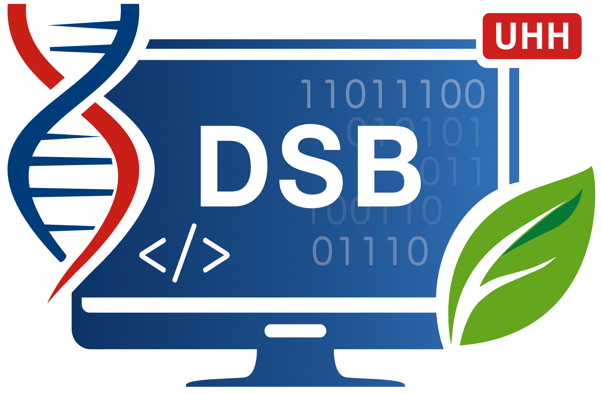

<!-- README.md is generated from README.Rmd. Please edit that file -->

# DSBswirl 

This R package provides the *swirl* courses, including an installation
function, developed for the DSB (Data Science in Biology) program within
the Biology Department of the University of Hamburg (UHH).

The following swirl courses (in German) are currently included:

- DSB-01: Basics in R (R Grundlagen)
- DSB-02: Data exploration with R (Datenexploration mit R)
- DSB-03: Data wrangling and introduction to tidyverse
  (Datenaufbereitung oder per Anleitung durchs Tidyversum)
- DSB-04: Data visualization with ggplot2 (Datenvisualisierung mit
  ggplot2)
- DSB-05: Working with special data types (Handling spezieller
  Datentypen)
- DSB-06: Advanced R programming (Fortgeschrittene R Programmierung)

There is an additional English *swirl* course, *Data analysis with R*,
covering R basics, data wrangling and visualization with the tidyverse,
and linear regression modelling.

## Package installation

``` r
if (!require("pak")) install.packages("pak")
pak::pak("uham-bio/DSBswirl")
```

## Course installations

``` r
# Install all courses (default)
DSBswirl::install_dsb_courses()

# Install only course DSB-01 (R basics)
DSBswirl::install_dsb_courses(courses = "DSB-01")

# Install the course DSB-01, DSB-04, and DSB-05
DSBswirl::install_dsb_courses(courses = c("DSB-01", "DSB-04", "DSB-05"))
```

If you already have an **older version of a course installed**,
overwrite it with `force = TRUE` - otherwise *swirl* asks for
confirmation per course and silently keeps the old version if you
decline:

``` r
DSBswirl::install_dsb_courses(force = TRUE)
```

------------------------------------------------------------------------

<br><br><br> Last Update: 05/10/2026
